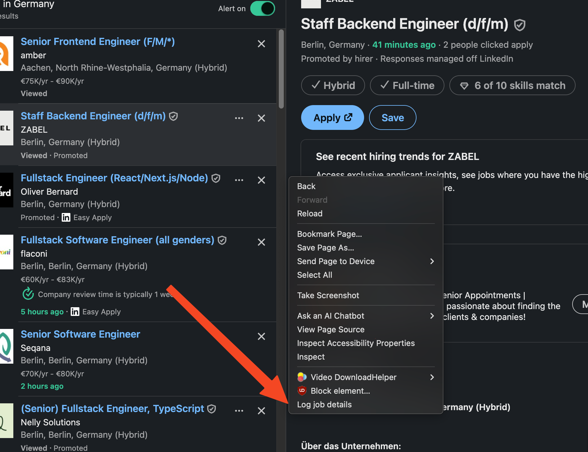
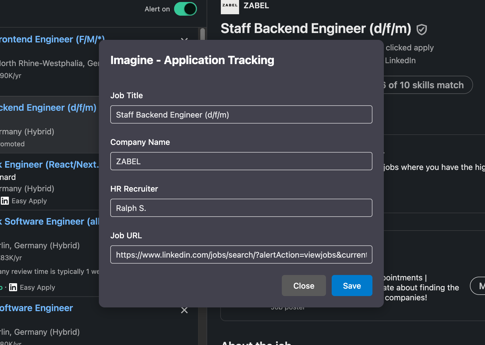

# Imagine Job Email Insert - Chrome Extension

A Chrome extension that streamlines job application tracking by automatically extracting job details from job boards and filling out Google Forms, reducing the manual process from ~40 seconds to just 4 seconds.




## 🚀 Performance Improvement

**Before**: ~5 roundtrips taking ~40 seconds

**After**: 2 clicks taking ~4 seconds

**Improvement**: **90% time savings** (36 seconds saved per job application)

## 🏗️ Architecture Overview

The extension follows a **message-passing architecture** where different components communicate through Chrome's runtime messaging system. Since content scripts cannot communicate directly with each other, the background script acts as a central message router.

```
┌─────────────────┐    ┌─────────────────┐    ┌─────────────────┐
│   Job Board     │    │   Background    │    │   Google Forms  │
│   Pages         │◄──►│     Script      │◄──►│     Page        │
│ (LinkedIn, etc.)│    │  (Message Hub)  │    │(Job Tracking)   │
└─────────────────┘    └─────────────────┘    └─────────────────┘
```

## 🔄 Communication Flow

### 1. **Context Menu Trigger** (Background Script)
- User right-clicks on any page
- Background script creates context menu: "Log job details"
- When clicked, sends message to content script on current tab

### 2. **Job Details Extraction** (Job Board Pages)
- Content script receives "getJobDetails" message
- Identifies job board type (LinkedIn, Xing, StepStone, etc.)
- Extracts job information:
  - Job Title
  - Company Name
  - Recruiter (if available)
  - Job URL
- Opens modal for user confirmation/editing
- Sends extracted data to background script

### 3. **Message Routing** (Background Script)
- Receives job details from job board page
- Finds open Google Forms tab
- Forwards job details to Google Forms page

### 4. **Form Auto-fill** (Google Forms Page)
- Receives job details from background script
- Automatically fills form fields
- Submits form (optional)
- Sends confirmation back

## 📁 File Structure & Responsibilities

### Core Components

#### `background.js` - Message Router & Context Menu
- **Role**: Central communication hub and context menu manager
- **Responsibilities**:
  - Creates right-click context menu
- - Listens for messages from content scripts
- - Routes messages between job boards and Google Forms
- - Manages tab communication

#### `imagine-job-tracking-page.js` - Google Forms Handler
- **Role**: Handles Google Forms page operations
- **Responsibilities**:
  - Listens for job details messages
  - Auto-fills form fields
  - Handles form submission
  - Manages email pre-filling

#### `job-boards/index.js` - Job Board Interface
- **Role**: Extracts job information from various job boards
- **Supported Platforms**:
  - LinkedIn
  - Xing
  - StepStone
  - Join.com
  - Greenhouse
- **Responsibilities**:
  - Detects job board type
  - Extracts job details using DOM selectors
  - Creates job details modal
  - Sends data to background script

#### `job-details-modal.js` - User Interface
- **Role**: Provides user interface for job details confirmation
- **Responsibilities**:
  - Displays extracted job information
  - Allows user editing
  - Handles save/cancel actions
  - Manages modal lifecycle

## 🔧 Technical Implementation

### Message Types

```javascript
// From background to job board
{ action: "getJobDetails" }

// From job board to background
{
  action: "fillJobDetails",
  content: {
    jobTitle: "...",
    companyName: "...",
    recruiter: "...",
    url: "..."
  }
}

// From background to Google Forms
{
  action: "fillJobDetails",
  content: { ... }
}
```

### Content Script Injection

The extension injects different content scripts based on the page:

- **Job Board Pages**: `job-boards/index.js`, `job-details-modal.js`
- **Google Forms**: `imagine-job-tracking-page.js`

### CSS Injection

- Uses `styles/css-injector.js` to inject custom styles
- Ensures consistent UI across different job boards

## 🎯 Supported Job Boards

| Platform | URL Pattern | Status |
|----------|-------------|---------|
| LinkedIn | `*.linkedin.com/jobs/*` | ✅ Full Support |
| Xing | `*.xing.com/jobs/*` | ✅ Full Support |
| StepStone | `*.stepstone.de/*` | ✅ Full Support |
| Join.com | `*.join.com/*` | ✅ Full Support |
| Greenhouse | `*.greenhouse.io/*` | ✅ Full Support |

## 🚧 Current Limitations

- **Hardcoded Email**: Username is currently hardcoded in the Google Forms handler
- **Content Script Isolation**: Cannot communicate directly between job board pages and Google Forms
- **Tab Dependency**: Requires Google Forms tab to be open

## 🔮 Future Enhancements

### High Priority
- [ ] **Dynamic Username Storage**: Save username in extension storage instead of hardcoding
- [ ] **Auto-open Forms**: Automatically open Google Forms if not already open
- [ ] **Error Handling**: Better error handling for failed extractions

### Medium Priority
- [ ] **More Job Boards**: Add support for Indeed, Glassdoor, Monster, etc.
- [ ] **Data Validation**: Validate extracted data before form submission
- [ ] **Custom Fields**: Allow users to configure which fields to extract

### Low Priority
- [ ] **Export Options**: Export job data to CSV/JSON
- [ ] **Analytics**: Track application success rates
- [ ] **Reminders**: Set follow-up reminders for applications

## 🛠️ Development Setup
### Chrome
1. Clone the repository
2. Open Chrome and navigate to `chrome://extensions/`
3. Enable "Developer mode" (toggle in top right)
4. Click "Load unpacked" and select the extension directory
5. The extension will appear in your extensions list

### Firefox (Temporary Debug Mode)
1. Clone the repository
2. Open Firefox and navigate to `about:debugging`
3. Click "This Firefox" in the left sidebar
4. Click "Load Temporary Add-on..."
5. Select the `manifest.json` file from your extension directory
6. The extension will load temporarily (will be removed on browser restart)
7. **Note**: Firefox requires Manifest V3 for production, but V2 works for development/testing

## 📝 Usage Instructions

1. **Navigate to a job posting** on any supported job board
2. **Right-click** anywhere on the page
3. **Select "Log job details"** from the context menu
4. **Review and edit** the extracted information in the modal
5. **Click "Save"** to automatically fill your Google Forms tracking sheet
6. **Ensure Google Forms tab is open** for the extension to work

## 🤝 Contributing

Contributions are welcome! Areas for improvement:
- Adding support for new job boards
- Improving data extraction accuracy
- Enhancing the user interface
- Adding new features

## 📄 License

This project is open source and available under the [MIT License](LICENSE).

---

**Built with ❤️ to make job hunting more efficient**
